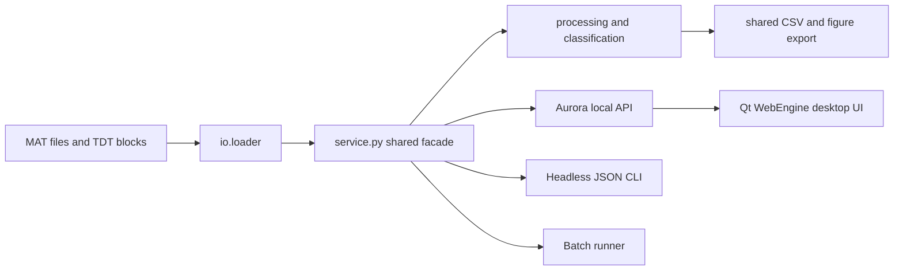

# Photon Cruncher Project Status

Last verified: 2026-08-12

This is the handoff document for continuing Photon Cruncher development. Read it
with `docs/architecture-aurora.md` and the root `AGENTS.md` before release,
packaging, or analysis-pipeline work.

## Current Snapshot

- Repository: `oliver-brandon/photon-cruncher` (public; default branch `main`).
- Public stable line: `main` at `4bd14a7`, tagged and released as `v1.1.4`.
- Development line: `dev` is synchronized with `origin/dev` at `10b2014`.
- Development product: Photon Cruncher Aurora, package version `2.0.1`, with
  in-app label `Aurora v2.0.1`.
- Signed Aurora dev prereleases `aurora-dev-v2.0.0` and
  `aurora-dev-v2.0.1` are published for updater testing. They remain isolated
  from the stable product; the newest public lab release is still v1.1.4.
- GitHub currently has no open issues, so the remaining work listed below is
  not otherwise tracked.

## Implemented Product

### Inputs And Discovery

- Loads TDT-generated MATLAB `.mat` files.
- Loads raw TDT block folders and discovers blocks inside TDT tanks.
- Supports multiple MAT files, multiple TDT tanks, and mixed-source batch work.
- Browser mode uses real file/folder upload controls and preserves relative TDT
  folder layouts in a temporary session directory.
- Local lab fixtures live under `local-test-data/` and remain ignored by Git.

### Scientific Pipeline

- Uses the shared MATLAB-faithful pipeline for the GUI, CLI, and batch runner.
- Pairs signal channels with their 405 controls when available, while also
  supporting signal-only analysis when the isosbestic fit is disabled.
- Supports configurable polynomial control fitting, smoothing, baseline
  normalization, downsampling, artifact thresholds, and raw/smoothed output.
- Treats `TRANGE end` as seconds after the epoc. A range of `-2` to `5` means
  two seconds before through five seconds after the event.
- Drops incomplete edge trials instead of clipping them and reports which trials
  were removed.
- Keeps control/signal rows and original trial numbers aligned through edge and
  artifact filtering.
- Matches MATLAB moving-mean endpoint behavior rather than zero-padding the ends.
- Preserves original trial numbers and timestamps through plots and exports.

### Aurora Desktop UI

- Aurora is the only GUI on `dev`: a Qt WebEngine desktop shell around a local
  web interface and HTTP API.
- Align + Visualize supports reactive epoc, channel, smoothing, and processing
  changes while preserving the selected display channel.
- Trial Explorer supports per-trial selection, independent settings, live
  redraws, selected-trial exports, and clear empty-selection behavior.
- Compatible behavioral epocs generate in-memory classified trial sources with
  correct/incorrect and rewarded/not-rewarded labels.
- Batch Export supports multiple sources, epoc suffix policies, channel
  selection, CSV and/or figure output, PNG/PDF/TIFF figures, and structured
  exported/skipped/failed reporting.
- Displayed and saved figures include source file, epoc, channel, labeled axes,
  and whole-numbered trial ticks aligned to heatmap rows.
- Processing settings and export destinations persist between app launches.
- Named processing presets persist locally, show an explicit `Custom` state
  after edits, and can be imported/exported as portable JSON.
- Scientific QC callouts flag incomplete-edge and artifact loss, missing 405
  controls, unstable baselines, non-finite values, and extreme z-scores.
- Plot summaries use compact JSON and fetch only the displayed heatmap as
  float32 data; stale requests are aborted and the analysis cache is bounded.
- Batch Export runs as one background job, loads each source once, reports live
  progress, and can be cancelled between analysis steps.
- Every result export includes an `_analysis.json` provenance/QC manifest.
- **Help -> Export Diagnostic Report...** saves data-free runtime, updater,
  cache, and recent-error details for troubleshooting.
- The native window restores its last size, position, and maximized state.

### CLI And Automation

- `photon-cruncher-cli inspect` reports sessions, channels, epocs, classified
  sources, trial-type counts, and warnings as JSON.
- `photon-cruncher-cli analyze` supports flags or reusable JSON configuration,
  trial-number/type filters, CSV and figure exports, and JSON run summaries.
- `photon-cruncher-cli validate-config` checks analysis configs before a run.
- Stable exit codes distinguish success, no output, invalid configuration, and
  loading/processing failures.
- macOS and Windows build definitions include the CLI beside the desktop app.
- A local Codex skill exists outside this repository for using the CLI as an
  agentic access point.

### Distribution And Documentation

- PyInstaller build scripts produce a movable macOS `.app`, Windows app folder,
  platform ZIP, and packaged CLI.
- Product/version metadata is centralized in `photon_cruncher/version.py` and
  consumed by Python packaging, build scripts, PyInstaller specs, and the UI.
- `scripts/version_metadata.py --check` rejects production files that reintroduce
  hard-coded canonical version values.
- GitHub Actions builds both platforms on manual dispatch and publishes release
  assets for isolated `aurora-dev-v*` tags.
- Installed Aurora dev apps use Velopack to check their platform channel,
  present release notes, download updates, and install on restart.
- The release workflow produces Windows/macOS installers, full/delta packages,
  and version feeds; it requires Developer ID signing and notarization on macOS.
- Installed apps and shortcuts use the friendly name **Photon Cruncher Aurora**.
  Downloadable installers use short versioned names while technical package and
  feed filenames retain the stable dev updater identity.
- The README covers installation, updates, Gatekeeper/SmartScreen warnings,
  browser mode, the CLI, Trial Explorer, and Batch Export.
- The project uses the MIT License.

## Architecture Decisions And Invariants

- Scientific logic belongs in `io/`, `processing/`, `analysis/`, `export/`, or
  `service.py`, never in Aurora JavaScript or shell code.
- `service.py` is the shared contract used by Aurora, the CLI, and batch work.
- Derived classified trials are in-memory views; never rewrite source MAT/TDT
  files to add them.
- Direct single-result exports always ask for a destination. Batch Export may
  reuse its selected destination.
- CSV and figure exports must retain their neighboring `_analysis.json`
  provenance manifest. Diagnostic reports must not include raw signal arrays.
- Aurora sessions are live and ephemeral; the application does not maintain a
  project database or import library.
- Browser uploads are temporary, limited to 4 GiB per file, and cleaned when the
  server exits.
- `main` is the currently released v1.1.4 PySide line. `dev` is the Aurora-only
  2.0 development line until an explicit merge and release.
- The Aurora window title and installed-app display name have no version or Dev
  suffix. The UI rail and downloadable installer names use the full semantic
  version from `photon_cruncher/version.py`.

## Verification Evidence

The following checks passed through 2026-08-12:

- The v2.0.1 regression suite passed all 92 tests, along with Python
  compilation, shell syntax, YAML parsing, centralized version consistency,
  and `git diff --check`.
- GitHub Actions run `31624933363` built both platforms successfully. The
  macOS application and installer passed Developer ID signing, notarization,
  and stapling before publication.
- The `aurora-dev-v2.0.1` prerelease contains readable macOS and Windows
  installer names, full and delta packages for both platforms, and isolated
  public feeds. Both feeds advertise package ID
  `com.photoncruncher.aurora.dev` at version `2.0.1`.

- Full 98-test suite covering loader, CLI, service, pipeline equivalence, Aurora
  frontend wiring, shell, browser upload, API, batch behavior, and centralized
  version/update metadata.
- Python compilation, PyInstaller spec compilation, JavaScript syntax checks,
  shell syntax, version consistency, and `git diff --check` passed.
- A clean macOS PyInstaller build produced
  `Photon Cruncher Aurora v2.0.0.app`; its Info.plist and packaged CLI both report
  `2.0.0`, and the app passed `codesign --verify --deep --strict`.
- A source wheel built successfully as `photon_cruncher-2.0.0-py3-none-any.whl`
  using the dynamic setuptools version.
- A live browser check showed the API-derived `Aurora v2.0.0` rail label and the
  canonical `Photon Cruncher Aurora` document title.
- A live browser workflow imported a MAT fixture, saved and reapplied a named
  preset across Align and Trial Explorer, switched display channels, rendered a
  nonblank selected-trial heatmap, and completed a three-channel background
  batch with CSV plus analysis manifests.
- The dense `1996_FR1-4_NA.mat` / `Tick` transport stress check reduced the
  displayed-view payload from 141.444 MiB of all-channel JSON to 0.174 MiB of
  summaries plus a 9.599 MiB displayed-channel matrix.
- Updater tests cover numeric version ordering, dev platform-channel isolation,
  unavailable-network behavior, and failed downloads that preserve the current
  installation. The GitHub workflow passes `actionlint`.
- A rebuilt macOS PyInstaller app contains Velopack 1.2.0's native extension,
  reports the dev bundle identifier, and still passes deep signature validation
  before Velopack's required Developer ID signing/notarization stage.
- The packaged `photon-cruncher-cli` loaded the real local TDT block
  `1996_FR1-4_NA`, found three channels, nine epocs, and two classified sources.
- That packaged CLI analyzed `CL2_` / `A_465` end to end and exported a 67-trial
  CSV with no dropped edge trials or artifact removals.
- The public v1.1.4 GitHub Actions release workflow completed successfully and
  published macOS and Windows ZIPs.

Some tests use `local-test-data/` and skip when those private fixtures are not
available. The tracked synthetic golden fixture still protects the core numeric
pipeline in clean checkouts.

## Unresolved Issues And Risks

1. **Aurora is not a stable release.** Signed dev prereleases are available for
   testing, but public lab users still receive v1.1.4 from `main`. Do not
   present Aurora v2 as stable until the separate stable release gate passes.
2. **No continuous test workflow.** GitHub Actions currently builds only on
   manual dispatch or tags. Pull requests and ordinary pushes do not
   automatically run the scientific regression suite, Python compilation, or
   JavaScript syntax checks.
3. **Windows still needs a hands-on smoke test.** The Aurora Windows installer,
   packages, and feed now build and publish successfully, but launch, analysis,
   export, and in-place update behavior have not been recorded on real Windows
   hardware. Windows is not Authenticode signed, so SmartScreen may appear.
4. **Private-fixture coverage is local.** Real MAT/TDT parity and behavioral
   classification checks depend partly on ignored lab data and will skip in a
   clean GitHub runner. More synthetic, de-identified fixtures are needed for
   full CI coverage.
5. **Updater bootstrap needs a two-version smoke test.** Unit tests cover version
   ordering, channel isolation, offline checks, and failed downloads. The
   published v2.0.0 to v2.0.1 update still needs to be installed and restarted
   on real macOS and Windows machines, including a Dock/shortcut check.
6. **Batch sources are processed sequentially.** The worker is responsive,
   cancellable, and loads each source once, but very large multi-file batches
   still scale roughly with recording count. Profile a representative lab batch
   before adding process-level parallelism.

## Recommended Next Work

1. Add a lightweight CI workflow for pushes and pull requests to `main` and
   `dev`: run the tracked tests, Python compilation, `node --check`, and
   `git diff --check`.
2. Test the published v2.0.0 to v2.0.1 update through the in-app indicator and
   **Help -> Check for Updates** on real macOS and Windows installations. Verify
   release notes, restart, retained settings, and the existing Dock/shortcut.
3. Fix any platform packaging defects, then plan the separate stable Aurora
   package ID/channels before merging `dev` into `main`.
4. Add small generated/synthetic MAT and TDT fixtures that exercise loader and
   classifier behavior without committing lab recordings.
5. Create GitHub issues or a v2 milestone for the unresolved items above so the
   public tracker reflects actual project work.

## Release Gate For Aurora v2

- All tests, compilation checks, JavaScript checks, and `git diff --check` pass.
- `scripts/version_metadata.py --check` passes.
- Manual Actions build succeeds from the intended commit on both platforms.
- Developer ID signing, notarization, `pkgutil`, and `spctl` validation succeed.
- The prerelease includes installers, full update packages, and both isolated
  `releases.aurora-dev-*.json` feeds.
- A real newer-version update installs and restarts successfully on each OS.
- macOS app launches, imports MAT/TDT, analyzes, and exports CSV plus figures.
- Windows app launches, imports MAT/TDT, analyzes, and exports CSV plus figures.
- Packaged CLI passes `inspect`, config validation, and one real analysis on
  each platform.
- README download names match the actual uploaded assets.
- `dev` is merged intentionally into `main`; the release tag is created from
  `main`, not from an unreviewed local state.

## Continuation Map

- Product/release guidance: `AGENTS.md`, `README.md`, this document.
- Architecture: `docs/architecture-aurora.md`.
- Performance: `docs/backend-performance.md` and `scripts/bench_backend.py`.
- Version source/check: `photon_cruncher/version.py` and
  `scripts/version_metadata.py`.
- Updater: `photon_cruncher/updates.py`, `packaging/velopack/`, and
  `scripts/package_*_update.*`.
- Shared facade: `photon_cruncher/service.py`.
- Science pipeline: `photon_cruncher/processing/pipeline.py`.
- Loader: `photon_cruncher/io/loader.py`.
- Classification: `photon_cruncher/analysis/trial_classifier.py`.
- Export: `photon_cruncher/export/exporter.py`.
- Aurora API/shell: `photon_cruncher/gui_aurora/server.py` and `shell.py`.
- Aurora frontend: `photon_cruncher/gui_aurora/static/`.
- CLI: `photon_cruncher/cli.py`.
- Packaging: `packaging/`, `scripts/build_*`, and
  `.github/workflows/build-desktop-apps.yml`.
- Tests: `photon_cruncher/tests/` using `.build-venv/bin/python`.

Do not commit `local-test-data/`, build output, virtual environments, Python
bytecode, or personal Codex notes.
